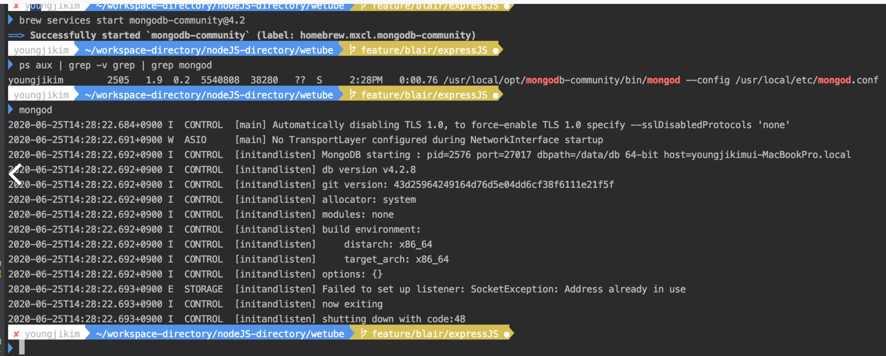
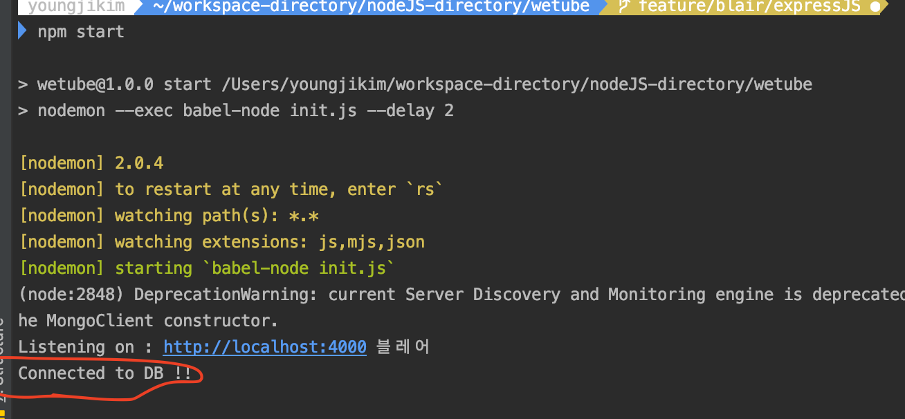
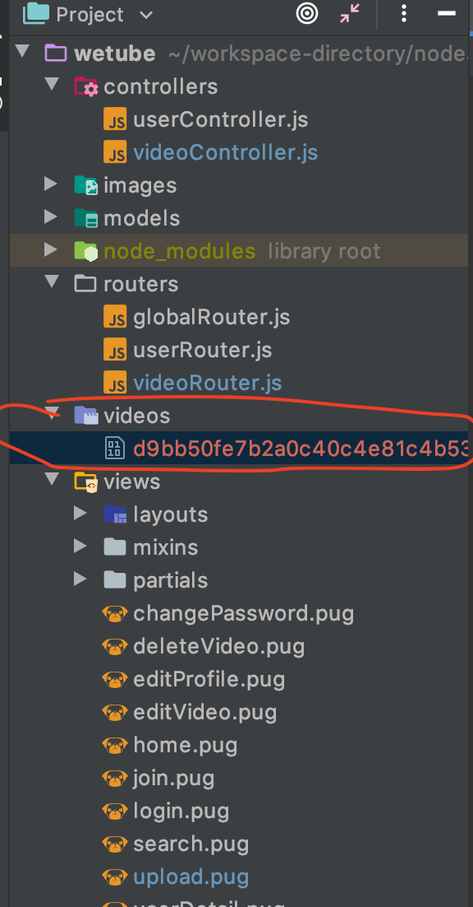
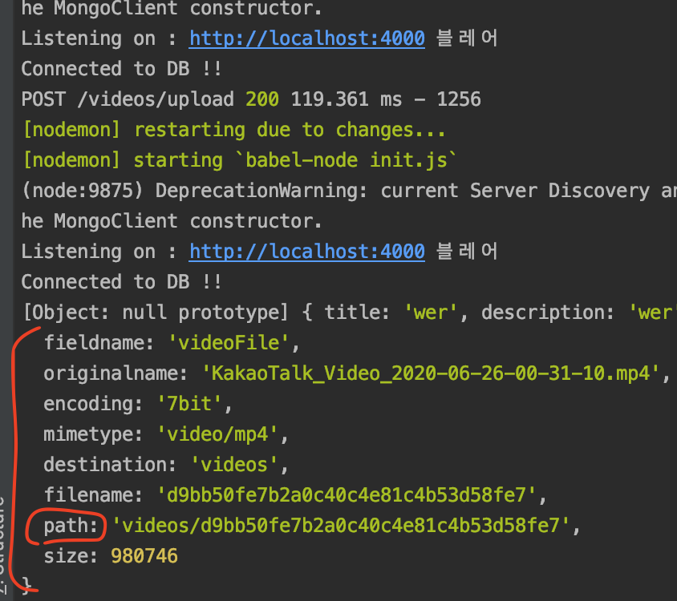
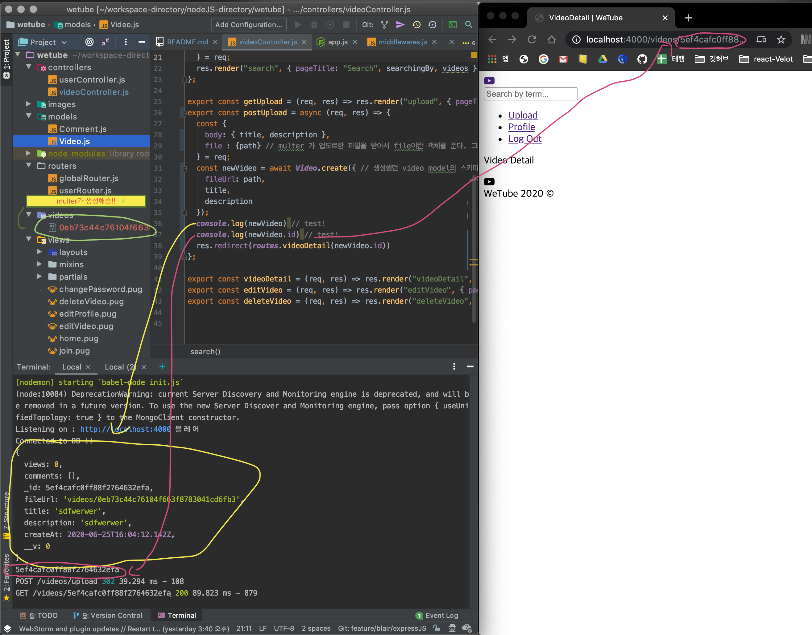
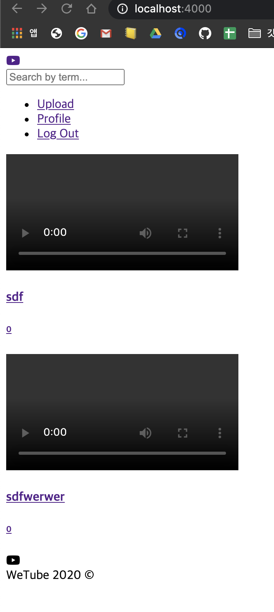
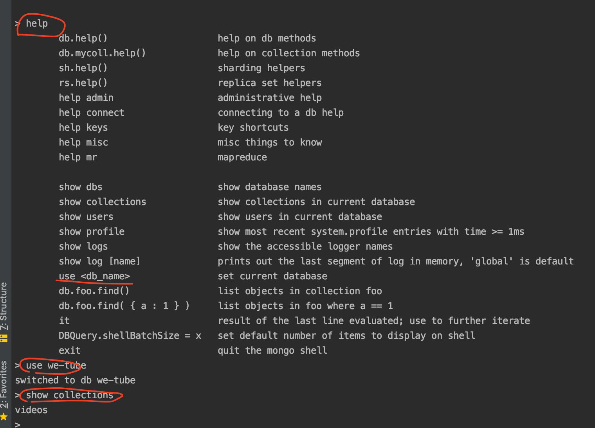
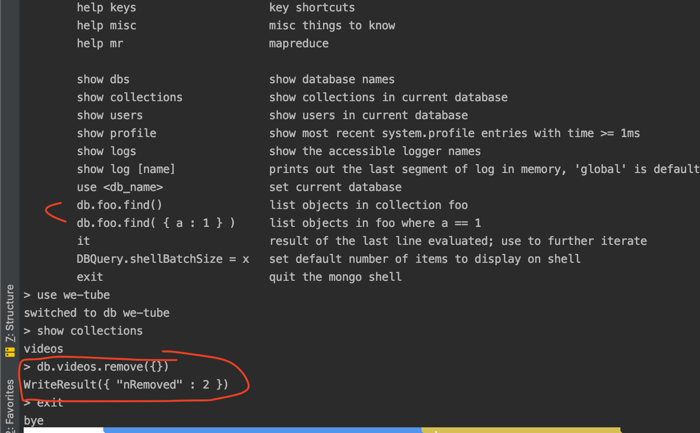
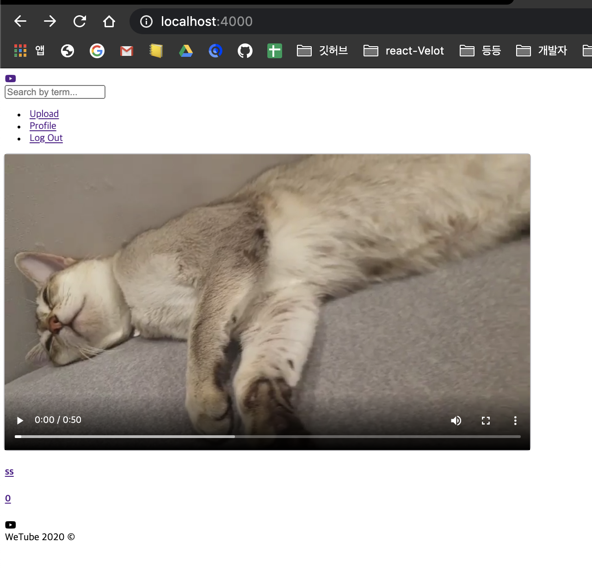
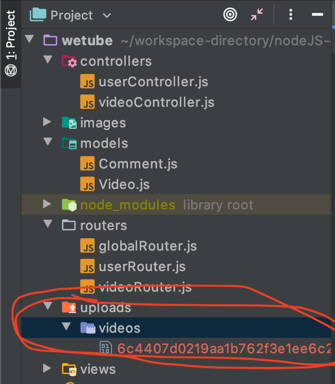

# wetube project
* wetube directory생성 후 IDE에서 작업

***

# < Setting >

## node.js 다운로드 
* npm 도 동시에 다운로드 된다.

## npm init -> package 생성하기 
* description, author만 typing 나머지는 enter => package.json파일이 생성된다.

* 생성된 package.json에서 script일단 삭제


## express framework 다운받기 -> npm install express
* express는 nodejs를 편히 쓰게해주는 프레임워크이다. 즉 nodejs응 이용해 서버를 만드는 것 이다.
* npm에서 express검색애서 Readme 참고해보기
* npm을 사용할때는 꼭 package.json이 있는 폴더에서 실행해야 한다.
* npm install express 설치하면 node_modules 폴더가 생긴다.

## .gitignore
* 깃헙에 올리고 싶지 않은 것들을 담기
* 이미 push된 경우에는 git rm -r --cached . 후 다시 push

## git init

## github repository 생성 후 push


* repo생성 후 터미널에서 git remote add origin https://github.com/Blair-0404/wetube.git
* git add .    ->    git commit -m "first commit"    -> git push origin master


## gitflow 전략 도입
* master기반 -> develop기반 -> feature/blair/현재작업명  (이곳에서 작업 후 develop으로 pr 및 merge)
* feature/blair/작업명 브랜치는 해당작업이 끝나면 develop 에 merge시키고 삭제 후 새 작업명으로 다시 feature브랜치 생성하기

 ***
 
# < Server Express>
## express 사용해서 서버생성 
1. index.js에 express를 import
2. 불러온 express를 실행해서 app 생성함
3. 4000으로 Port번호 지정하고 app.listen 테스트
    * app이 4000포트를 listen하면 콜백함수 실행
```javascript
    // app.js

    const express = require('express') // express를 import
    // 즉 나의 폴더 어딘가에서 express를 찾는다. 없다면 node_modules에서 찾아서 불러온다.
    const app = express() // 불러온 express를 실행해서 app생성
    
    const PORT = 4000; // 열어줄 포트번호 지정
    
    function handleListening(){ // 콜백함수 생성
      console.log(`Listening on : http://localhost:${PORT}`)
    
    }
    
    app.listen(PORT, handleListening) 
    // 실행되면 터미널에 Listening on : http://localhost:4000 찍힌다.
```

## package.json 에 script 추가
```javascript
// package.json
    "scripts": {
    "start": "node app.js"
      }
```
* 이제 서버를 열떄 node index.js가 아닌 npm start 로 열 수 있다.

## GET api test
* 콜백함수 만들고 app.get(라우트,CB) 테스트 해봄 => 서버 켜진 상태에서 라우트 들어가면 CB실행된다.
* 웹사이트처럼 작동하려면 re.send에 메시지가 아닌 html,css,JS 등 파일이 전송되야한다.
    * 본 프젝에서 도전해볼 것 이다.
```javascript
    // app.js

    // CB 생성
    function handleHome(req, res) {
      res.send("Hello from home") // 브라우저에 뜨는 메세지
    
    }
    
    function handleProfile(req,res) {
      res.send("You are on my profile")
      // 웹사이트처럼 작동하려면 re.send에 메시지가 아닌 html,css,JS 등 파일이 전송되야한다.

    }

    // app.get 테스트
    app.get("/", handleHome);
    // 첫 인자로 라우트지정, 두번쨰 인자로 해당라우트 접속시 실행될 CB
    // 서버를 키고 브라우저에서 http://localhost:4000/로 접속하면 콜백함수가 실행된다.
    
    app.get("/profile", handleProfile);
```

## ES6 사용위해 BABEL 도입
### npm install @babel/node  ->  npm install @babel/preset-env
* ES6로 코딩하고싶지만 브라우저의 상황에 따라서 읽지 못할 수도있기때문에 바벨을 사용해서 안정화된 버전으로 낮춰주는 것 이다.
* Babel node 사용 => nodeJS에서 Babel을 사용할거라서
1. babel을 설치하고 .babelrc 파일생성 후 babel-preset-env plugin 설정해줌
    * .babelrc : babel plugin들을 모아놓고 사용할 설정파일
    
    ```javascript
   //.babelrc
   
   {
     "presets": ["@babel/preset-env"]
   }
   ```
2. index.js에서 erpress 를 ES6로 import 해보기 and 함수->arrow func
3. package.json에서 "start": "babel-node app.js" 로 변경 후 테스트 
    * 테스트 에러 -  npm install @babel/core 설치 후 다시 npm start 테스트
    
       ```javascript
      // package.json
      // start변경됨
      
        "scripts": {
          "start": "babel-node app.js"
        },
      
      ```
    
## nodemon package 설치  -> npm install nodemon -D
* 변경사항이 있을때마다 서버를 껏다 켜야해서 불편함을 느꼈다.
* nodemon이 있으면 변경사항이 바로 반영된다.
* 하지만 프로젝트 실행에 필요한것이 아므로 dependencies에 겹치지 않게 해야함
    * npm install nodemon -D (뒤에 -D를 부여해)
       ```javascript
      // package.json
      // 새로운 entryPoint 생성됨.
      
        "devDependencies": {
          "nodemon": "^2.0.4"
        }
      
      ```
    * start 변경해주기
    
      ```javascript
      // package.json
          
       "scripts": {
       "start": "nodemon --exec babel-node app.js"
       },
          
       ```
* 이제 새로 저장할 떄마다 저절로 서버가 재실행된다.

## 트러블슈팅1.
* 바벨이 변환을 완료할때까지 기다리는 시간이 부족해서 서버가 자동으로 실행되는게 2번씩 실행될때가 있었다.
* 바벨의 변환시간을 2초정도 기다려 주기위해 package.json - scripts 변경

  ```javascript
  // package.json
          
    "scripts": {
    "start": "nodemon --exec babel-node app.js --delay 2"
    },
   ```
  
## express - middleware
* express에서 모든 함수는 middleware가 될 수 있다.
* exspress에서 middleware란 유저와 마지막 응답사이에 존재하는 것이다..?
    * 말 그대로 중간에 존재하는 소프트 웨어
* 웹사이트에 접속 - index.js실행 - app이 라우트 존재하는지 살펴본다.
    * 라우트 찾으면 인자로 넣은 CB(응답을 실행하는)실행 하게되는데 라우트요청과 CB사이에 미들웨어가 실행된다.
    * test (유저의 home "/"요청과 handleHome 사이에 미들웨어 추가)
    
    ````javascript
  // app.js
  
  
  // CB
  const handleHome = (req, res) => res.send("Hello from home"); 
  
  // middleware CB
  const betweenHome = () => console.log("I'm between");
  
  // Routes
  app.get("/", betweenHome, handleHome);
  
  ````
    * 하지만 위 코드는 / 라우트로 갈 경우 터미널에 I'm between는 찍히지만 handleHome 는 실행되지않고 계속 로딩중이게 된다.
        * 브라우저로부터 온 요청을 계속 처리할지에 대해, 그 오쳥이 handleHome으로 처리될지 등의 권한을 주지 않았기 때문이다.
        * 즉 요청을 계속 처리할 권한을 줘야한다.
        
            ````javascript
          // app.js
          // next라는 key이용해서 다음 실행권한주기
          
         
          // CB 이게 마지막 함수이므로 next인자 필요없다.
          const handleHome = (req, res) => res.send("Hello from home");
          
          // middleware CB 즉 middleware CB함수에만 next인자가 들어간다.
          const betweenHome = (req,res,next) => {
            console.log("I'm between");
            next(); // 다음 함수를 실행하게 해줌
          };
          
          // Routes
          app.get("/", betweenHome, handleHome);
          
          ````
        * 즉 middleware CB함수에만 next인자가 들어간다. handleHome은 마지막 함수이므로 next인자가 필요없다.
        * 하지만 이 경우는 middleware를 "/'라우트에만 사용한 경우 
        * 전체적으로 사용하려면? (코드의 순서가 굉장히 중요하다)
        
        ````javascript
          // app.js
      
          // middlewares 위치중요
          app.use(betweenHome) // 미들웨어를 전체 라우트에 사용
          
          // Routes
          app.get("/", handleHome);
          app.get("/profile", handleProfile);
      
        ````
* 즉 middleware 는 코드 내 위치가 중요하다.

### middleware - Morgan 설치 후 사용해보기  ->  npm install morgan
* Morgan ? logging에 도움을 준다. 
* logging이란? 무슨일이 어디서 일어났는지 기록하는 것 이다.
* morgan은 몇가지 로깅옵션들이 있다.
* 설치 후 app.js 에 import morgan from "morgan"; 해주기 

#### morgan - tiny옵션 사용해보기
* 아래처럼 app.use 코딩해준 후 
````javascript

    // app.js
    
    // middlewares
    app.use(morgan("tiny"))

    // Routes
    app.get("/", handleHome);
    app.get("/profile", hndleProfile);
````
* npm start -> 브라우저에 http://localhost:4000/ or /profile 경로로 이동해주면 아래처럼 로깅정보가 찍힌다.


#### morgan - combined옵션 사용해보기
* 어쩐종류 접속인지, 어떤 브라우저인지 등의 정보 표시
* 아래처럼 app.use 코딩해준 후 
````javascript

    // app.js
    
    // middlewares
    app.use(morgan("combined"))
  
    // Routes
    app.get("/", handleHome);
    app.get("/profile", hndleProfile);
````
* npm start -> 브라우저에 http://localhost:4000/ or /profile 경로로 이동해주면 아래처럼 로깅정보가 찍힌다.


### middleware - helmet 설치 후 사용해보기  ->  npm install helmet
* 보안관련 미들웨어 
* 설치 후 app.js 에 import helmet from "morgan"; 해주기 
* index.js에서 미들웨어 위치에 app.use(helmet())추가

### middleware - body-parser 설치 후 사용해보기  ->  npm install body-parser
* body로부터 정보를 얻을 수 있게 해준다.
* 누군가가 form을 채워서 전송하게 된다면 그 form은 서버에 의해서 받아져야한 한다. 특정한 형태(옵션)로.
* form을 받았을 때 그 데이터를 갖고있는 requestObject에 접근할 수 있어야 하므로 body-parser 사용해야한다.
* 옵션을 정의해줘야 한다. (=> 서버가 유저로부터 받은 데이터를 이해하는 방법)
* 옵션들에 대해서 다 알아야 한다. 내 무엇을 전송하는지 알 수 있어야 하니까.
    * bodyParser.json
    * bodyParser.text
    * bodyParser.urlencoded
* 설치 후 app.js 에 import bodyParser from "body-parser"; 해주기 

    ````javascript
      // app.js
  
      // middlewares
  
      app.use(bodyParser.json()) // json 받으면 이해하기
      app.use(bodyParser.urlencoded({extended : true}))
  
    ````

### middleware - cookie-parser 설치 후 사용해보기  ->  npm install cookie-parser
* cookie를 다루는데 도와준다. 유저로부터 받은 cookie를 이해하는 방법
* session을 다루기 위해서 cookie에 유저정보를 저장한다.
* 설치 후 app.js 에 import cookieParser from "cookie-parser"; 해주기 


### middleware 가 연결을 끊게할 수도 있다.
* 원한다면 미들웨어로 연결을 끊을 수 있다.
* 미들웨어가 res.sent를 실행하는 함수를 발동하면 (next()가 있어도) 연결이 끊긴다.
````javascript
    // app.js
    
    // CB
    const handleHome = (req, res) => res.send("Hello from home"); // 브라우저에 뜨는 메세지

    // middlewares
    const middleware = (req, res, next) => {
      res.send("not happening");
      next()
    };
    
    // Routes
    app.get("/", middleware, handleHome);

````
* 즉 위 코드에서 handleHome 는 실행이 안된다.


## Routing

### ES6 module 사용 : 다른 파일끼리 코드를 가져다 사용할 수 있다.
* init.js생성 후 index.js -> app.js파일변경 후 app.js에서 불필요한 코드 부분 삭제
* app.js에 있는 Object를 init.js에 주려한다.
* ES6 module : 다른 파일끼리 코드를 가져다 사용할 수 있다.
    * app.js에서 express, helmet, morgan 등등의 모듈을 node_modules에서 가져와 사용했었다.
    * 이제 app.js를 init.js로 가져와 사용해보기 위해 app.js하단에 export 해주기
    ````javascript
     // app.js
    
     export default app;
     // 누군가가(=다른 파일이) app을 import하면 app Object를 주겠다는 의미.
     // app Object ? app.js 에 코딩한 모두를 의미
    ````
    * init.js 에도 app.js를 import해주고 test해보기
    ````javascript
     // init.js
        
     import app from "./app";
         
     const PORT = 4000;
         
     const handleListening = () => console.log(`Listening on : http://localhost:${PORT}`);
         
     app.listen(PORT, handleListening) // app을 해왔고 app.js에서 이미 express로 서버를 생성해 놨기 때문에 .listen 사용가능
    ````
    * package.json - scripts nodemon init.js가 시작되게 변경
    ````javascript
     // package.json
  
      "scripts": {
        "start": "nodemon --exec babel-node init.js --delay 2"
      },
    ````
### express - Router 사용
* router란 route들의 복잡함을 쪼개주는데 사용할 수 있다.
* userRouter.js 파일 생성
    ````javascript
    // userRouter.js
  
    import express from "express"
    
    export const useRouter = express.Router(); // express의 Router사용!
    // app.js에서 사용할 수 있게 변수 선언과 동시에 바로 export 해주기
    
    useRouter.get("/", (req, res) => res.send('user index'))
    useRouter.get("/edit", (req, res) => res.send('user edit'))
    useRouter.get("/password", (req, res) => res.send('user password'))
   
    ````
* app.js에서 import해서 사용하기
    ````javascript
    // app.js
  
    import { useRouter } from "./userRouter"; // export default 를 하지않았어서  { }로 import 함
    
    app.use("/user", useRouter)
    // app.use => 누군가가 /user 경로에 접근하면 useRouter의 라우터전체를 사용하겠다는 의미이다.

    ````
* 실행 후 브라우저에서 /user 로 접속한 결과


### export const 변수명 VS export default 변수명
* 위 두개의 차이점은 뭘까?
    * export const 변수명 (= 해당 변수만 export)
        * 변수를 생성함과 동시에 바로 export를 해주는 방식
        * 이러한 경우에는 import를 하는 쪽에서 import { 변수명 } from "경로" 즉 { } 로 import를 해줘야 한다.
        * 해당 변수만 export하기 떄문에 export하는 파일쪽에 다른 변수들이있다면 그것은 export 되지 않는다.
    * export default 변수명 (= 파일 전체를 export)
        * 위에서 변수를 생성하고 마지막 부분에 export default를 해주는 방식
        * 이러한 경우에는 import를 하는 쪽에서 import 변수명 from "경로" 로 import를 해줘야 한다.
        * 전체를 export하기 떄문에 파일 내의 어떤 것도 import 받은 쪽에서 사용가능

## MVC(= Model View Control) Pattern
* Model - data(DB - 뒤에서 다룰 예정)
* View - data가 어떻게 생겼는지?
* Controller - 데이터를 찾는 함수

### MVC 1 - Routers 분리
* 설치하는게 아니라 단지 패턴일 뿐이다. 본 프로젝트에 적용 도전!
    * 데이터의 모습에 맞춰서 url과 함수를 분리할 것 이다.
    * 라우터들을 기능에 따라서 분리 
        1. app.js 에서 삭제가 필요한 부분 삭헤하고 router.js -> useRouter.js 파일명 변경
        2. videoRouter.js, globalRouter.js 파일 새로 생성
        3. routers directory생성 후 useRouter.js, videoRouter.js, globalRouter.js 담기
        4. app.js에서 생성된 router들 import
            ````javascript
           // routers/videoRouter.js
           import express from "express"
           
           const videoRouter = express.Router();
           
           export default videoRouter
           
           // routers/globalRouter.js
           import express from "express"
           
           const globalRouter = express.Router();
           
           export default globalRouter   
            ````
           
            ````javascript
           // app.js
           import useRouter from "./routers/userRouter";
           import videoRouter from "./routers/videoRouter";
           import globalRouter from "./routers/globalRouter";
        
           app.use("/", globalRouter);
           app.use("/users", useRouter); // app.use => 누군가가 /user 경로에 접근하면 useRouter의 라우터전체를 사용하겠다는 의미이다.
           app.use("/videos", videoRouter); 
           
            ````

### MVC 2 - URL 생성
* router.js 파일 생성 후 모든 URL 생성
````javascript
// routes.js
//여기에 URL들을 생성해서 어디에서든 이 URL을 불러다 쓸 예정(이유는 나중에,,)

// Global
const HOME = "/";
const JOIN = "/join";
const LOGIN = "/login";
const LOGOUT = "/logout";
const SEARCH = "/search";

// Users
const USERS = "/users";
const USER_DETAIL = "/:id";
const EDIT_PROFILE = "/edit-profile";
const CHANGE_PASSWORD = "/change-password";

// Videos
const VIDEOS = "/videos";
const UPLOAD = "/upload";
const VIDEO_DETAIL = "/:id";
const EDIT_VIDEO = "/:id/edit";
const DELETE_VIDEO = "/:id/delete";


const routes = {
  home: HOME,
  join: JOIN,
  login: LOGIN,
  logout: LOGOUT,
  search: SEARCH,
  users: USERS,
  userDetail:USER_DETAIL,
  editProfile:EDIT_PROFILE,
  changePassword:CHANGE_PASSWORD,
  videos:VIDEOS,
  upload:UPLOAD,
  videoDetail:VIDEO_DETAIL,
  editVideo:EDIT_VIDEO,
  deleteVideo:DELETE_VIDEO
};

export default routes;
````
* app.js에도 url을 직접 써줬던 부분을 변경해주기
````javascript
// app.js
import routes from "./routes";

// global Router
app.use(routes.home, globalRouter)

// detail Routers
app.use(routes.users, useRouter);
app.use(routes.videos, videoRouter);

````
* routers/globalRouter.js와 routers/userRouter.js 와 routers/videoRouter.js 에서 필요한 URL들 받기
````javascript
// routers/globalRouter.js

import express from "express"
import routes from "../routes";

const globalRouter = express.Router();

globalRouter.get(routes.home, (req, res) => res.send("Home"));
globalRouter.get(routes.join, (req, res) => res.send("Join"));
globalRouter.get(routes.login, (req, res) => res.send("Login"));
globalRouter.get(routes.logout, (req, res) => res.send("Logout"));
globalRouter.get(routes.search, (req, res) => res.send("Search"));

export default globalRouter


// routers/userRouter.js

import express from "express"
import routes from "../routes";

const useRouter = express.Router(); // express의 Router사용!

useRouter.get(routes.users, (req, res) => res.send("users"));
useRouter.get(routes.userDetail, (req, res) => res.send("userDetail"));
useRouter.get(routes.editProfile, (req, res) => res.send("editProfile"));
useRouter.get(routes.changePassword, (req, res) => res.send("changePassword"));


export default useRouter


// routers/videoRouter.js

import express from "express"
import routes from "../routes";

const videoRouter = express.Router();


videoRouter.get(routes.videos, (req, res) => res.send("videos"));
videoRouter.get(routes.upload, (req, res) => res.send("upload"));
videoRouter.get(routes.videoDetail, (req, res) => res.send("videoDetail"));
videoRouter.get(routes.editVideo, (req, res) => res.send("editVideo"));
videoRouter.get(routes.deleteVideo, (req, res) => res.send("deleteVideo"));

export default videoRouter
````

### MVC 3 - Controller (= 콜백함수 분리하기)
#### Controller먼저 한 후 뒤에 View->Model순으로 패턴 진행할 예정
* Controller는 어떤 일이 어떻게 발생하는지에 관한 로직이다.
* 대게 프로젝트에 있는 각 모델마다 컨트롤러 생성하는 편이다.
* 본 프젝에서는 video와 video를 업로드할 user 등의 모델이 필요(routes.js에 있는것들)
    * routers폴더에 있는 router파일들의 모든 콜백함수들을 Controller에 담을 것 이다.
    1. controllers폴더 생성 후 videoController.js, userController.js 생성할 것이다.
    2. test로 globalRouter.js에 있던 콜백함수들을 videoController.js, userController.js로 옮기고 import해보기
    ````javascript
    // controllers/videoController.js
    
    export const home = (req, res) => res.send("Home");
    export const search = (req, res) => res.send("Search");
    
    export const videos = (req, res) => res.send("videos");
    export const upload = (req, res) => res.send("upload");
    export const videoDetail = (req, res) => res.send("videoDetail");
    export const editVideo = (req, res) => res.send("editVideo");
    export const deleteVideo = (req, res) => res.send("deleteVideo");
  
  
    // routers/videoRouters.js
  
    import express from "express"
    import routes from "../routes";
    import { videos, upload, videoDetail, editVideo, deleteVideo } from "../controllers/videoController"
    
    const videoRouter = express.Router();
    
    videoRouter.get(routes.videos, videos);
    videoRouter.get(routes.upload, upload);
    videoRouter.get(routes.videoDetail, videoDetail);
    videoRouter.get(routes.editVideo, editVideo);
    videoRouter.get(routes.deleteVideo, deleteVideo);
    
    export default videoRouter
    
    ````
  
    ````javascript
    // controllers/useController.js
  
    export const join = (req, res) => res.send("Join");
    export const login = (req, res) => res.send("Login");
    export const logout = (req, res) => res.send("Logout");
  
    export const users = (req, res) => res.send("users");
    export const userDetail = (req, res) => res.send("userDetail");
    export const editProfile = (req, res) => res.send("editProfile");
    export const changePassword = (req, res) => res.send("changePassword");
  
    // routers/useRouters.js
  
    import express from "express"
    import routes from "../routes";
    import { users, userDetail, editProfile, changePassword } from "../controllers/userController"
    
    
    const useRouter = express.Router(); // express의 Router사용!
    // app.js에서 사용할 수 있게 변수 선언과 동시에 바로 export 해주기
    
    
    useRouter.get(routes.users, users);
    useRouter.get(routes.userDetail, userDetail);
    useRouter.get(routes.editProfile, editProfile);
    useRouter.get(routes.changePassword, changePassword);
    
    
    export default useRouter
    ````
  
    ````javascript
    // routers/globalRouter.js
  
    import express from "express"
    import routes from "../routes";
  
    // controllers import
    import { home, search } from "../controllers/videoController"
    import { join, login, logout } from "../controllers/userController"

    
    const globalRouter = express.Router();
    
    globalRouter.get(routes.home, home);
    globalRouter.get(routes.search, search);
    globalRouter.get(routes.join, join);
    globalRouter.get(routes.login, login);
    globalRouter.get(routes.logout, logout);
    
    export default globalRouter
    ````
* 나중에는 콜백함수의 로직에서 데이터를 가져오거나 에러를 처리하는 등의 복잡한 로직을 구현해야할 수 있기때문에 controller를 따로 분리하는것은 좋다.

   
### MVC 4 - View - Pug -> npm install Pug
* Pug는  템플릿 언어로 express의 view engine이다. (express에서 view를 다루는 방식 중 하나)
* pug는 HTML을 세련되게 보이게 할 수도 있다는게 장점이고 직접 템플릿을 작성하는 것 보다 프로그래밍을 더 빠르게 할 수 있다.
* express로 HTML을 보여줄 수 있다. res.sent()대신 실제 HTML을 전달가능하고 CSS로 꾸밀수도 있다.
#### Pug 사용 test
* npm install Pug 설치 후 공식문서 사용법참고
    * app.set()으로 application 설정 하기 -> 본프젝에서는 view engine을 변경할 것이다(기본값은 undefined)
    ````javascript
    // app.js
    app.set('view engine', "pug") // view engine을 변경할것이다. 확장자명을 pug로 설정

    ````
    * Pug와 express에는 view파일들의 위치에 관한 기본설정이 있는데 바꾸고싶다면 'views'설정을 바꾸면된다.
        * application의 화면이 담긴 디렉토리나 디렉퇴의 배열 입력하면 된다.
        * html파일을 저장해야 하는 폴더의 기본값은 => 프로젝트의 작업 디렉토리 + '/views' 이다.
    * views 폴더 생 후 내부에 home.pug 확장자로 파일생성 
    ````javascript
    // views/home.pug 
    // html처럼 변환해준다.
  
    p Hello PUGPUG

    ````
    
    * 브라우저에서 home 라우트 접속시 pug파일의 내부가 보이기
    ````javascript
    // videoController.js
    export const home = (req, res) => res.render("home"); // 확장자가 pug인 파일명을 render의 인자로

    ...
    ...
    ... 
    // 나머지 controller파일들도 send->render로 변경해줌
    ````
  
#### Pug Layouts 작업
* pug의 문법은 <>를 사용 않고 들여쓰기를 한다.
* views폴더에 layouts폴더 생성 후 내부에 main.pug 파일 생성해서 layout 코딩하기
    * layout은 모든 템플릿파일에서 같은 코드를 반복해주지 않기 위해서 꼭 필요하다.
    * layout에 공통적인 부분을 코딩하고 다른 파일마다는 필요한 내용들만 넣기
    ````javascript
    // views/layouts/main.pug
    
    doctype html
    html
        head
            title WeTube
        body
            header
                h1 @WeTube@
            main
                block content // content 부분에 각 템플릿들(.pug파일들)에 들어간다.
            fotter
                span &copy; WeTube
    ````
 
* 템플릿에서 레이아웃 확장시키기
    ````javascript
    // views/home.pug
  
    extends layouts/main // 레이아웃 코드들을 템플릿에서 사용하고(복붙) + 추가적인 것도 더하겠다는 의미
    
    block content
        p Hello PUGPUG
  
    ...
    ...
    ...
    // 나머지 템플릿파일들도 모두 생성해줌
    ````
  

#### Pug Partials 작업(조직화)
* 프로그래밍은 분할정복이다.(하나씩 나눠가면서 처리해야함)
* views/partial 폴더 생성
    * views/partial/footer.pug 생성
    ````javascript
    // views/partial/footer.pug
  
    footer.footer
        .footer__icon
            i.fab.fa-youtube
        span.footer__text WeTube #{new Date().getFullYear()} &copy;
  
    ````
  
    * views/partial/header.pug 생성
    ````javascript
    // views/partial/header.pug
  
    header.header
        .header__column
            i.fab.fa-youtube
        .header__column
            ul
                li
                    a(href="#") Join 듯
                    // routes.js에서 만든 URL과 연결할 예정
                li
                    a(href="#") Log In
  
    ````
* partial 파일에 작업 후 layouts 파일 변경
    ````javascript
    // views/layouts/main.pug
    
    doctype html
    html
        head
            title WeTube
        body
            include ../partials/header // 변경
            main
                block content // content 부분에 각 템플릿들(.pug파일들)에 들어간다.
            include ../partials/footer // 변경
    ````

#### Pug - Templates 에 Controller 정보 추가
* 템플릿 전체에 or 한개에 추가가능
#### Pug - Templates 에 Controller 정보 추가 - 템플릿 전체에 추가하는 방법(locals사용)
* locals를 이용해템플릿 전체에 추가하는 방법
    * 미들웨어 생성 : routes.js의 local변수를 global변수로 사용하기 위해
        * middlewares.js 파일생성(미들웨어 함수는 모두 여기에)
    ````javascript
    // middlewares.js  
  
    export const localsMiddleware = (req, res, next) => {
      res.locals.siteName = 'WeTube';
      res.locals.routes = routes;
      next();
    };
  
    ````
  
    ````javascript
    // app.js
  
    import { localsMiddleware } from "./middlewares"
    ...
    // middleWares (순서대로 진행되기 떄문에 순서중요)
    ...
    // 미들웨어실행의 가장 마지막 순서에 넣기!
    app.use(localsMiddleware); // pug - 템플릿에서 routes.js 접근하기
    ````
  
    ````javascript
    // views/layouts/main.pug
    // test
    
    doctype html
    html
        head
            link(rel="stylesheet", href="https://use.fontawesome.com/releases/v5.5.0/css/all.css" integrity="sha384-B4dIYHKNBt8Bc12p+WXckhzcICo0wtJAoU8YZTY5qE0Id1GSseTk6S+L3BlXeVIU", crossorigin="anonymous")
            title #{siteName} // 이부분!!!
                              // locals에 있는건 템플릿에서 변수명처럼 존재한다.
        body
            include ../partials/header
            main
                block content
            include ../partials/footer
 
    ````
    ````javascript
    // views/partials/header.pug

    header.header
        .header__column
            i.fab.fa-youtube
        .header__column
            ul
                li
                    a(href=routes.join) Join // 라우트파일의 변수명에 이제 접근가능
                li
                    a(href=routes.login) Log In // 이제 클릭하면 url 변경된다.
    
    ````
    
..

#### Pug - Templates 에 Controller 정보 추가 - 템플릿마다 정보듣 다르게 추가하는 방법
* Controller내부의 함수 자체에 인자를 설정함으로써 템플릿에 변수를 전달하는 방법이다.
    * res.render(연결할 템플릿.pug, 템플릿에 추가할 정보가 담긴 객체)
    * 즉 원하는 변수(객체)를 controller에서 템플릿에 직접전달
    * 템플릿마다 보여줘야하는 결과가 다를경우 이 방법 유용( 본 프젝에서는 거의 이 방법으로 정보를 추가할 것이다,)
   
````javascript
// controllers/videoController.js

export const home = (req, res) => res.render("home", { pageTitle: "Home" }); // 첫인자 템플릿, 두번쨰인자 템플릿에 추가할 정보가 담긴객체
// 즉 pageTitle이 "home" 으로 전달됨
export const search = (req, res) => res.render("Search", { pageTitle: "Search" });

export const videos = (req, res) => res.render("videos");
export const upload = (req, res) => res.render("upload", { pageTitle: "Upload" });
export const videoDetail = (req, res) => res.render("videoDetail", { pageTitle: "VideoDetail" });
export const editVideo = (req, res) => res.render("editVideo", { pageTitle: "EditVideo" });
export const deleteVideo = (req, res) => res.render("deleteVideo", { pageTitle: "DeleteVideo" });

````

````javascript
// views/layouts/main.pug

doctype html
html
    head
        link(rel="stylesheet", href="https://use.fontawesome.com/releases/v5.5.0/css/all.css" integrity="sha384-B4dIYHKNBt8Bc12p+WXckhzcICo0wtJAoU8YZTY5qE0Id1GSseTk6S+L3BlXeVIU", crossorigin="anonymous")
        title #{pageTitle}  |  #{siteName}  
             //  #{pageTitle} 추가해주면 controller에서 설정한 템플릿마다 객체의 값이 다르므로 결과가 다르다.
    body
        include ../partials/header
        main
            block content
        include ../partials/footer

````

### Search Controller
* 검색창에 키워드 입력시 라우트 변경, 키워트담은 화면 새로 그려짐

#### [Pug Pages Plan]
 - [ ] Home
 - [x] Join -> [commit Log](https://github.com/Blair-0404/wetube/commit/73839fcb25032ce002e52f49c5b1128e80a97615)
 - [x] Login -> [commit Log](https://github.com/Blair-0404/wetube/commit/73839fcb25032ce002e52f49c5b1128e80a97615)
 - [x] Search -> [commit Log](https://github.com/Blair-0404/wetube/commit/73839fcb25032ce002e52f49c5b1128e80a97615)
 - [ ] User Detail
 - [x] Edit Profile -> [commit Log](https://github.com/Blair-0404/wetube/commit/ac727c3309649afdbd929ed747eeac7246de565d)
 - [x] Change Password
 - [x] Upload
 - [x] Edit Video
* 필요한곳에서 html을 재사용하기 위해 mixins 방법사용
    * mixins : 웹사이트에서 자주 반복되는 html코드를 담고있다. / pug의 함수의 하나이다
    
    
    
# < Server MongoDB >
* MongoDB 는  NoSQL이다. 사용이 수월하고 직관적이다.
* MongoDB Community Server다운로드 
## mongoDB설치
[설치가이드](https://docs.mongodb.com/manual/tutorial/install-mongodb-on-os-x/)
1. brew tap mongodb/brew
2. brew install mongodb-community@4.2
* brew services start mongodb-community@4.2 (스타트)
* brew services stop mongodb-community@4.2  (스탑)
* ps aux | grep -v grep | grep mongod (실행중인몽고디비 확인)
3. mongo (실행해서포트확인)
    
### 추가적으로 npm install mongoose, npm install dotenv 도 설치
* dotenv는 숨기고싶은 부분을 숨길 수 있는 기능이다.

## 설치한것들로 db.js 다시 코딩 후 mongoDB 테스트
````javascript
// db.js

import mongoose from "mongoose";

mongoose.connect("mongodb://localhost:27017/we-tube", {
  useNewUrlParser: true, useFindAndModify: false
}); // 어디에 DB가 저장되어있는지 알려줘야한다. so DB의 URL이 들어가야함

const db = mongoose.connection;// MongoDB와의 연결을 'db'로 저장

const handleOpen = () => console.log("Connected to DB !!")
const handleError = (error) => console.log(`Error on DB Connection!! ${error}`)

db.once("open", handleOpen)// connetion을 열고 성공여부를 확인할 수 있는 함수 넣기
// once는 한번실행
db.on("error", handleError)

````
* videoController.js에 db.js를 import하던 부분을 지우고 init.js에서 import시켜주기
````javascript

// init.js
import "./db"
````



    
## dotenv 구성
* 숨기고 싶은 것을을 key로 숨겨서 다른곳에서 보이지 않게 하기
1. .env 파일생성 후 mongodb주소와 port번호 넣기
2. db.js에 직접 넣었던 mongodb주소를 지우고 dotenv를 import해서 주소변수 넣기 and init.js에도 직접넣었던 port번호 지우고 dotenv를 import해서 PORT변수 넣기
3. .gitignore 에 .env파일 추가 
````javascript
// .env
MONGO_URL="mongodb://localhost:27017/we-tube"

PORT=4000

// db.js
import dotenv from "dotenv";

dotenv.config() // dotenv.config함수로 .env파일 안에 있는 정보 불러오기

mongoose.connect(process.env.MONGO_URL, // 찾은 모든 변수들을 proccess.env.key에 저장하기
  {
    useNewUrlParser: true, useFindAndModify: false
  }
);

// init.js
import dotenv from "dotenv";

dotenv.config() // dotenv.config함수로 .env파일 안에 있는 정보 불러오기
// 찾은 모든 변수들을 proccess.env.key에 저장하기

const PORT = process.env.PORT || 4000; // 만일 key 못찾음 4000으로 !
````

## MongoDB 사용
* mongoDB 의 장점은 document를 줄여준다는 장점이있다.
* 하지만 MongoDB에 내 파일들이 어떤 식으로 생겨야 할지 알려줘야 한다.즉 아주거나 생성할 수는 없다는 의미이다.(타당성이 필요함)
* ex)  "MongoDB야 내 파일들을 video라는 이름을 가질거고 모든 video들은 stringType을 가질거고 그 string의 이름은 title이야"
    * "video는 view를 가질거고 view는 number type일거야 "
* 이런식으로 모델의 스키마를 생성해야 한다.

### Video model 생성하기(스키마생성 후 생성된 스키마로 모델만들어주기)
* models폴더 생성 후 그 안에 Video.js생성
    * models/Video.js 에 ViewoSchema생성 
        * 비디오는 Database에 저장하는것이 아닌 (Amazon)서버에 비디오를 저장할 것 이다.
            * 떄문에 스키마의 fileUrl에는 주소만 넣을 것이다.
        * [mongoose의 다양항 schema형식들 참고](https://mongoosejs.com/docs/guide.html)
       
````javascript
// models/Video.js
import mongoose from "mongoose"; // 스키마 생성위해 mongoose import 

// schema 생성하기
const VideoSchema = new mongoose.Schema({
  fileUrl: { // 주소를 넣을뿐 비디오 자체를 넣는것은 아니다.(너무무거워지기 떄문에) 비디오 자체는 서버(amazon)에 넣을 것 이다.
    type: String,
    required: "File URL is required" // error 메세지
  },
  title: {
    type: String,
    required: "Title is required"
  },
  description: String, // 더 주고싶은 옵션이 없다면 한줄로 충분하다.!
  views: { // 더 주고싶은 옵션이 있다면 객체로 만들어야 한다.
    type: Number,
    default: 0
  },
  createAt: {
    type: Date ,
    default: Date.now
  }
});


// 모델생성 (위에서 만든 schema로 model 생성하기!)
const model = mongoose.model("Video", VideoSchema);  // 모델의 이름은 "Video" 이고, Video model의 schema는 VideoSchema 이다.

export default model;
````

* 아직 Database는 인지못하고있다. 즉 생성한 모델을 Database가 인식하게 해주기위해서 init.js에 import 해주기
````javascript
// init.js
import "./models/Video"
````

### Comment model 생성하기
* models폴더 내부에 Comment.js생성

* 한쪽에서 video를 생성하고, 다른쪽에서 Comment를 생성했을 떄 두개를 어떻게 연결시킬까?
    1. comment에 연결된 videio ID를 Comment에 넣어 줄것인가.(CommentSchema에서 ref:"Video")
    2. vidio에 - comment ID들을 array로 video에 넣을것인가.(VideoSchema에서 ref:"Comment")
        * Object ID들의 array생성하기
    * 나는 두번째 방법을 선택했다.

````javascript
// models/Comment.js
// 방법 1 comment에 연결된 videio ID를 Comment에 넣어 주는방법


import mongoose from "mongoose";

const CommentSchema = new mongoose.Schema({
  text: {
    type: String,
    required: "Text is required"
  },
  createdAt: {
    type: Date,
    default: Date.now
  }, video: {
    type: mongoose.Schema.Types.ObjectId, // 이 comment는 이 video와 연결되어있고 이 videio type은 ~
    ref: "Video" // 이때 ObjectId가 어느 model에서 온건지 알려둬야한다.
  } // Databade에는 video: 1 이런식으로 저장 될 것이고 mongoose에게 ID 1에 해달하는 Videio를 가져오라고 할 것이다.
})
// ( comment를 생성하면 text,createdAt,videio : 1이런식의 저장될것이다. )
const model = mongoose.model("Comment", CommentSchema)
export default model;


// 방법 2 vidio에 - comment ID들을 array로 video에 넣어주는 방법
const VideoSchema = new mongoose.Schema({
...
...
...

  comments: [{
    type: mongoose.Schema.Types.ObjectId, // 이렇게 하면 모든 Comment의 정보를 여기 넣는게 아니라 Comment의 ID만 넣는 것 이다.
                                          // [1,2,4,7]이런식으로 Video와 연결된 Comment들의 ID가 저자오디는 것 이다.
    ref: "Comment"
  }]
});
````

* 아직 Database는 인지못하고있다. 즉 생성한 모델을 Database가 인식하게 해주기위해서 init.js에 import 해주기
````javascript
// init.js
import "./models/Comment" // 이렇게 해줘야 Database가 작동한다.
````

### 생성한 model들 사용하려면?
* 현재상태로 브라우저에서 접속하 ReferenceError: videos is not defined 등의 에러가 뜰 것이다.
    * model만 생성했을 뿐 그것을 Database로서 뿌리지는 않았기 때문이.
* controllers/videoController.js 에서 만들어진 videio모델을 import한 후 데이터 받아오는 부분을 비동기 처리로 해줘야 한다ㅣ.!
````javascript
// controllers/videoController.js
import Video from "../models/Video"; // 이건 Database의 element가 아니라 단지 model일 뿐 아예 다른 것 이다.
// element를 받는 통로일 뿐이지 element자체는 아니다. // 아래 비동기 처리를 하면서 Database의 요소들을 부를 예정


export const home = async (req, res) => { // 비동기를 해주지 않으면 없는 video를 찾게된다.
  try{
    const videos = await Video.find({}); // Video.find({})로 Database에 있는 모든 Video를 가져오는 것을 기다려달라 해야한다.
    // throw Error("에러!"); // 에러가 나도 catch로 처리를 해줬기 때문에 home화면이 잘 그려질 것이다. // 하지만 try,catch가 아닌 상태에서 에러나면 Nodejs가 뻗어서 브라우저도 연결이 끊긴다.
    res.render("home", { pageTitle: "Home", videos }); // res.render(첫인자 템플릿, 두번쨰인자 템플릿에 추가할 정보가 담긴객체)
  } catch (error) { // 에러처리를 하지않으면 Video.find({})가 실패하더라도 res.render가 진행되서 꼬이기 때문에 에러처리 해줘야한다.
    console.log(error);
    res.render("home", { pageTitle: "Home", videos: [] }); // 에러난경우(db에서 videos가져오기 실패한경우)에는 그냥 default로 빈 배열을 담기
  }
};
...
...
...
````

### 비디오 Upload 기능 1. 비디오아닌 파일은 들어오지 않게하기
* upload.pug에서 처리함
````javascript
// views/upload.pug
...
...
            input(type="file", id="file", name="videoFile", required=true, accept="video/*") // accept="video/*"로 비디오만 받게 처리함 
                                                                                        // 애초에 비디오가 아닌 파일들을 선택할수가없다.
...
...
````

### 비디오 Upload 기능 2. DB에 업로드한 파일의 location(url)을 저장하기 
* 중요한건 파일 자체를 저장하지않고 파일의 location!!을 저장하려는 것 이다.
* 어떻게 user가 videiofile을 선택해서 upload하고 해당 file url을 얻고 그 url로 video 생성 해야할까????
    * file을 upload하고 URL을 반환하는 middleware를 사용해보자!!!
        * file 업로드-> middleware에서 받고 upload하기 -> url복사해서 Database에 저장하기
####  middleware multer 사용  ->  npm install multer
* [npm 문서](https://www.npmjs.com/package/multer)
* upload form의 enctype에 multipart/form-data를 추가해줘야 한다.
    * file을 보 내는거라서 form의 encoding이 달라야 하기 때문이다.
````javascript
// views/upload.pug
...
...
    .form-container
        form(action=`/videos${routes.upload}`, method="post", enctype="multipart/form-data")
            label(for="file") Video File
...
...
````
* middleware.js에서 // 설치한 multer로 middleware 생성하기
````javascript
// middleware.js
import multer from "multer";
...
// 설치한 multer로 middleware 만들어보기
const multerVideo = multer({ dest: "videos" });
...
export const uploadVideo = multerVideo.single('videoFile'); // single 오직한 파일만 ("들어올 파일이 이름")
````
* 생성된 미들웨어를 사용하기!
    * routers/videoRouter.js에서 upload를 post요청하는 부분에 미들웨어 추가해주기
````javascript
// routers/videoRouter.js
import {uploadVideo} from "../middlewares";
...
const videoRouter = express.Router();
...
videoRouter.get(routes.upload, getUpload);
videoRouter.post(routes.upload, uploadVideo, postUpload); // 이부분에 uploadVideo 미들웨어 추가해주기
// mluter middleware를 통해서 업로드한 파일의 url을 알아내는 기능을 구현
````
* 이제 브라우저에서 업로드를 테스트 해보면 multer가 프로젝트에 videos폴더생성하고 그 안에 파일을 생성한다.

* 또 multer가 file이란 객체도 주는데 poasUpload메소드에서 console.log로 확인해보니 이미지와 같다.

* path가 우리가 원하는 파일의 주소임!

* 이제 multer의 기능을 이용해서 videoControllers.js에서 postUpload함수에서 비동기 처리를 구현해서 video 요소 생성해보기!!
````javascript
// controllers/videoControllers.js

import Video from "../models/Video"; // 이건 Database의 element가 아니라 단지 model일 뿐 아예 다른 것 이다.
// element를 받는 통로일 뿐이지 element자체는 아니다.
...
export const postUpload = async (req, res) => {
  const {
    body: { title, description },
    file : {path} // multer 가 업도르한 파일을 받아서 file이란 객체를 준다. 그 안에 path가 있다.
  } = req;
  const newVideo = await Video.create({ // 생성했던 video model의 스키마 폼에 맞춰 real video element만들기!
    fileUrl: path,
    title,
    description
  });
  console.log(newVideo) // test!
  console.log(newVideo.id) // test!
  res.redirect(routes.videoDetail(newVideo.id))  // 위에서 비동기처리로 비디오 요소가 만들어진 후이기 때문에 id를 잘 뽑아낼 수 있다.
};
...
...
````
* 브라우저 해서 업로드 해본 결과는?!?!? 두구두구

* home에 가면 이렇게 내가 업로드 한 비디오가 생겨있다.!


### upload까지는 됬지만 home에서 비디오들이 아직은 재생이 안된다.(link가 망가져서)
* 즉 mongoDB model이 한 document를 Database에 저장했는데 그 documnet는 잘못된 URL을 갖고있다.
    1. 일단 저절도 생성된 video폴더 삭제 
    2. middleware.js 에서 const multerVideo = multer({ dest: "uploads/videos/" }); 로 dest를 변경해주기
    3. routes에도  Upload를 위한 기본적인 route 생성해줘야한다
    * 이제 dest를 올바르게 바꿧으니 아래에서 테스트해보면 업로드가 문제없이 될 것 이다.  
* database에서 업로드 했던 video삭제하는 방법
    * mongo와 대화하기
    * 터미널에서 mongo -> help -> use we-tube -> show collection 입력하면 아래처럼 현재생성된 datamodel 보여준다.

* 삭제해보기 위해서 명령어 입력하면 삭제하고 삭제한 갯수 알려준다. -> exit으로 끄기


#### 빠뀐 dest에 upload다시 해보기
````javascript
// app.js
...
app.use("/uploads", express.static("uploads")) // 누군가가 /uploads로 간다면 express.static(directory명)을 이용
// express.static() 은 directory에서 file을 보내주는 middleware func이다.
...


// middleware.js
...
const multerVideo = multer({ dest: "uploads/videos/" }); // 이제 업로드를 하면 multer가 uploads/videos/ 의 경로에 파일을 저장할 것 이다.
...

````
* 이제 업로드 후 홈화면으로 가면 영상재생이 잘 된다.!

* 업로드 함과 동시에 middleware.js에서 설정해준 것 처럼 프로젝트 구조에 uploads/videos/파일생성이 된다.

* 하지만 이렇게 파일들을 다루는것은 사실 좋지 않다. (규모가 커질수록)
    * 무거워지기 때문에 서버에 파일들있는 것 보다 아마존에 맡기는게 좋을 것 같다.. 뒤에서..!할 예정

### videoDetail 템플릿에 현재 비디오에 대한 정보들 받아오기(db에서)
* video를 클릭하면 videoDetail 페이지로 이동하게된다 -> videoDetail 템플릿 페이지에 현재 비디오의 정보들을 그려주고싶다.
* videoDetail 템플릿에 video정보들을 넘겨주기 위해 Controller/videoController.js에서 videoDetail func에서 비동기 처리 등 해주기
````javascript
// Controller/videoController.js
export const videoDetail = async (req, res) =>{
  console.log(req.params); // { id: '5ef5ae14ba9c95358860c825' } 가 콘솔에 찍힌다
  // (routes.js에서 const VIDEO_DETAIL = "/:id"; 로 해줬기 떄문에)
  const {
    params: {id}
  } = req; // url변수인 id뽑기

  try{
    const video = await Video.findById(id); // video db에서 윗줄에서 뽑은 id와 같은 비디오 찾기!
    console.log(video) // 현재 보고있는 비디오의 상세정보 확인!
    res.render("videoDetail", { pageTitle: "VideoDetail", video }); // video: video로 템플릿에도 전달(화면에 video정보 뿌리기 위해)
  } catch (error) {
    console.log(error)
    res.redirect(routes.home);

  }
}
````


### videoDetail 템플릿에서 db에서 받은 정보들로 화면 그리기 작업 다시하기
* 작업할 기능들
    1. 영상(o)
    2. 타이틀(o)
    3. 조회수 (o)
    4. 유저이름
    5. 댓글
    6. 수정기능 버튼(비디오를 만든 사람만 볼 수 있게 하고싶다.)(o)
* 위에 controller로부터 video라는 이름으로 정보들담긴 Obj를 받은상태이다!
````javascript
// views/videoDetail.pug

extends layouts/main

block content
    .video__player
        video(src=`/${video.fileUrl}`) // 비디오 // 지금은 서버에 파일이 있기 떄문에  /을 꼭 붙여줘야한다.
    .video__info
        a(href=routes.editVideo) // 수정기능 버튼
        h5.video__title=video.title // 타이들
        span.video__views=video.views // 조회수
        p.video__description=video.description
````


### editVideo
* 비디오 수정 후 서버에 업뎃 요청하기!
````javascript
// views/videoDetail.pug
...
block content
    .video__player
        video(src=`/${video.fileUrl}`)
    .video__info
        a(href=routes.editVideo(video.id)) Edit Video // 이부불을 클릭하면 editPage로 이동하기(id를 그대로 넘겨주면서!)
        h5.video__title=video.title
        span.video__views=video.views
        p.video__description=video.description


// views/editVideo.pug

extends layouts/main

block content
    .form-container
        form(action=routes.editVideo(video.id), method="post") //  id넘겨받고
            input(type="text", placeholder="Title", name="title", value=video.title)//  해당비디오의 현재 저장된 타이들
            textarea(name="description", placeholder="Description")=video.description
            input(type="submit", value="Update Video")
        a.form-container__link.form-container__link--delete(href=`/videos${routes.deleteVideo}`) Delete Video


// routes.js
const routes = {
...
  editVideo: id => { // 넘겨받은 아이디를 url에 표시
    if(id) {
      return `/videos/${id}/edit`;
    } else {
      return EDIT_VIDEO;
    }
  },
  deleteVideo: DELETE_VIDEO
};
...

//  Routers/videoRouter.js
...
videoRouter.get(routes.editVideo(), getEditVideo); // 수정페이지 들어갈때 현재 비디오의 정보들 요청해야함
videoRouter.post(routes.editVideo(), postEditVideo); // 수정사항 입력 후 서버에 업뎃을 post요청 해야함
...

// Controllers/videoController.js
...
export const getEditVideo = async (req, res) => {
  const {
    params: {id} // id 가져오기
  } = req;
  try {
    const video = await Video.findById(id)
    res.render("editVideo", { pageTitle: `Edit ${video.title}`, video });

  } catch (error) {
    res.redirect(routes.home);
  } // 만일 해당 비디오를 못찾으면 존재하지 않는 비디오를 수정하는 것이니 error처리로 home으로 보내기로 함
}


// 어떤 비디오를 수정하는지 알아야 한다.
export const postEditVideo = async (req, res) => {
  const {
    params: {id},
    body: {title, description} // db의 비디오 정보의 속성
  } = req;
  try {
    await Video.findOneAndUpdate({_id: id},{title, description} )
    // 이 기능은 서버에세 데이터 전송해서 업데이트 요청만하고 다시 무언가를 받아올 필요가 없기 떄문에 변수에 담지 않는 것 이다,
    res.redirect(routes.videoDetail(id)); // 수정된 비디오 정보가 잘 반영됬는지 확인하고싶다!
  } catch(error) {
    res.redirect(routes.home);
  }
};
...

````


### delete Video구현
* deletevide는 get 요청만 있을 것이다. 
* 비디오 삭제를 누르면 이 부분의 URL을 가져와서 해당하는 비디오를 삭제할 것이다. post로는 할일이 없다.
````javascript
// routes.js
...
  deleteVideo: id => { // 아이디 받으면서 deletepage로 이동
    if(id) {
      return `/videos/${id}/delete`;
    } else {
      return DELETE_VIDEO;
    }
  }
};

// views/editVideo.pug

extends layouts/main

block content
    .form-container
        form(action=routes.editVideo(video.id), method="post") 
            input(type="text", placeholder="Title", name="title", value=video.title)
            textarea(name="description", placeholder="Description")=video.description
            input(type="submit", value="Update Video")
    a.form-container__link.form-container__link--delete(href=routes.deleteVideo(video.id)) Delete Video // 삭제버튼 클릭하면 삭제하는 함수 실행(인자는 해당비디오)


// Router/videoRouter.js
...
videoRouter.get(routes.deleteVideo(), deleteVideo); // 함수로 바뀐부분은 이렇게 () 호출을 해야 함수가 실행된다.
...


//  Controller/videoController.js
...
export const deleteVideo = async (req, res) => {
  const {
    params: {id}
  } = req;
  try { // db에서 해당 비디오 찾아서 지우기
    await Video.findOneAndRemove({_id: id}); // 이런 메소드는 몽구스공식문서에서 찾아보기!
    res.render("deleteVideo", {pageTitle: "DeleteVideo"});
  } catch (error) {
    console.log(error)
  }
  res.redirect(routes.home) // 실패하던 성공하면 home으로 가고싶어서 밖으로 아예 뻈다.

}
...

````

### ES Lint?  npm install eslint -g -> eslint --init 으로 실행
* Linter는 뭔가 틀린게 있거나 사용되지 않는 부분이 있으면 바로 알려준다.
* npm 설치시 -g 를 붙이는 이유? 
    * npm은 package를 설치하는 것 이다.(현재 폴더에 있는 node_modules에) 
    * 하지만 떄떄로 내 컴퓨터의 아무곳에서 나 사용하고 싶을 수 도 있다 그런경우 -g(lobal) 붙인다.
    * 모든 프젝에서 사용가능!
#### npm install eslint-config-prettier
#### npm install eslint-plugin-prettier
#### npm install prettier 


### search (video) 